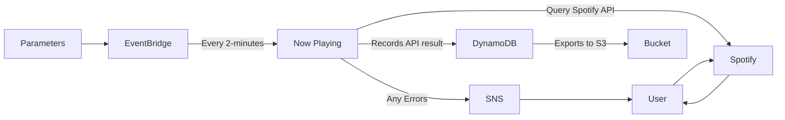
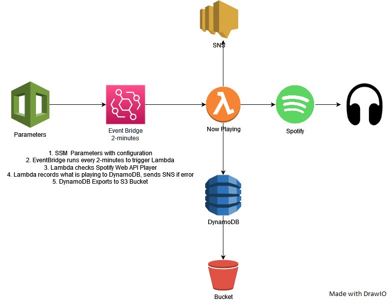

# Description

This is the basic diagram of what this is.

I'll probably put a diagram of the Workflows and other stuff later.

## Mermaid

```mermaid
  graph LR
  lambda -- Any Errors --> SNS --> User
  Parameters --> EventBridge -- Every 2-minutes --> lambda[Now Playing] -- Query Spotify API --> Spotify --> User
  User --> Spotify
  lambda -- Records API result --> DynamoDB -- Exports to S3 --> Bucket
```

## DrawIO

