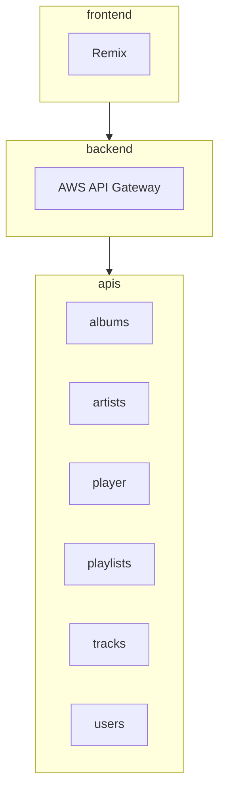

# Idea

An end-user navigates to my website and logs into Spotify. This login redirects to Clerk or self-hosted alternative. This login flow gets a `refresh token` and `access token`. Clerk automatically refreshes access token. 

A self-hosted API then accepts a user's `access token` to then query Spotify API. The self-hosted API would have my Spotify application `client id` and `client secret`. My API would be a simple proxy to Spotify API.

My API would need to have permissions to query the below [Spotify APIs](https://developer.spotify.com/documentation/web-api/tutorials/getting-started)
- Albums
- Artists
- Player
- Playlists
- Tracks
- Users

This API could then feed the front-end for a similar `wrap` concept. 

The front-end was written in NextJS, but I'm thinking of re-writing in Remix, NextJS, Astro, or Hugo. The latter two are more static site generators. These could be useful for portions of the website, possibly. But, if you're going to be dynamic, might as well just go with Remix/Next.

Front-end authentication could be by `id` or `email`. 

A `golang` client could also be created for easier calls. The end user would need their own API key. Or just authenticate to the CLI.

# Diagram

